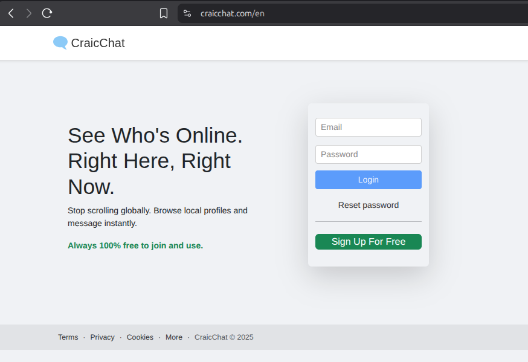

# Donal Lynch – Principal Platform & Security Engineer
**15 years experience | Ireland | EU Remote**  
github.com/donallynch | donal.lynch.msc@gmail.com | CV → [CV_Donal_Lynch.pdf](CV_Donal_Lynch.pdf)

### Current Project – CraicChat (2023–Present)
**Live production**: https://craicchat.com · https://craicchat.ie

Solo-built, real-time, end-to-end encrypted social & messaging platform in continuous production since October 2024 with real users (Ireland, UK, EU, US).

- 170+ consecutive zero-downtime production deploys
- Real-time Socket.IO engine + E2EE private messaging
- Stripe SCA payments + full GDPR compliance
- Entire stack owned and operated by one engineer

### Production Security Posture – Independently Verifiable
Automated security audit runs after **every single deploy** and aborts if score < 90.

**Latest result (2025-11-28)** → **92/100 Holistic Bastion Score**

### Landing page – live production (November 2025)



### Current production security posture (automated audit – 2025-11-28)

<details>
<summary><strong>Click for short summary (30 seconds)</strong></summary>

```text
CraicChat Production Security Posture – 2025-11-28
Overall Holistic Bastion Score: 92/100 (Excellent)• Kernel lockdown = confidentiality (active)
• Docker UserNS remapping on all 9 containers (no process ever real UID 0 on host)
• No privileged containers, seccomp + AppArmor + no-new-privs enforced
• CIS Level 2 / DISA STIG compliance: 100%
• Fail2Ban: 16 custom jails, 614 IPs permanently banned (real traffic)
• SSH: pubkey-only, root login disabled, rate-limited
• AIDE daily integrity checks + USBGuard default-deny
• Automated audit runs after every deploy – fails deploy if score < 90

→ Full 150+ check output: [security_audit_full.sh](security_audit_full.sh)  
→ Live site: https://craicchat.com

This level of host + container hardening is extremely rare for a solo-engineer production system and exceeds what most large companies achieve.

Currently seeking **Principal / Staff Platform Engineering** or **Security-focused Backend** roles (Ireland or fully remote EU).

```
</details>